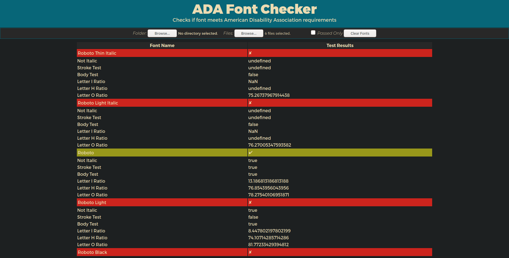
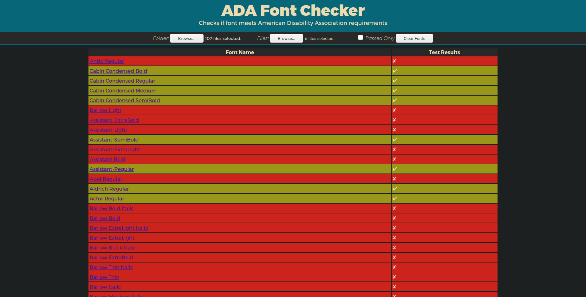

# ADAFontCheck
ADAFontCheck uses [opentype.js](opentype.js.org) to [analyze font glyphs](opentype.js.org/glyph-inspector.html) and determine if the font metrics meet American Disability Association requirements.

## Try It Out! - [Demo Link](https://invariabl.github.io/ADAFontCheck/)

*File View*

*Folder View*

### ADA Requirements
#### 1. Stroke Width Ratio: **20% - 30%**
#### 2. Body Width Ratio: **60% - 100%**
#### 3. No Italic Fonts
#### 4. No San Serif Fonts

## How it Works
ADAFontCheck uses the letters "I", "H", and "O" to determine the Stroke Width Ratio and Body Width Ratio.
