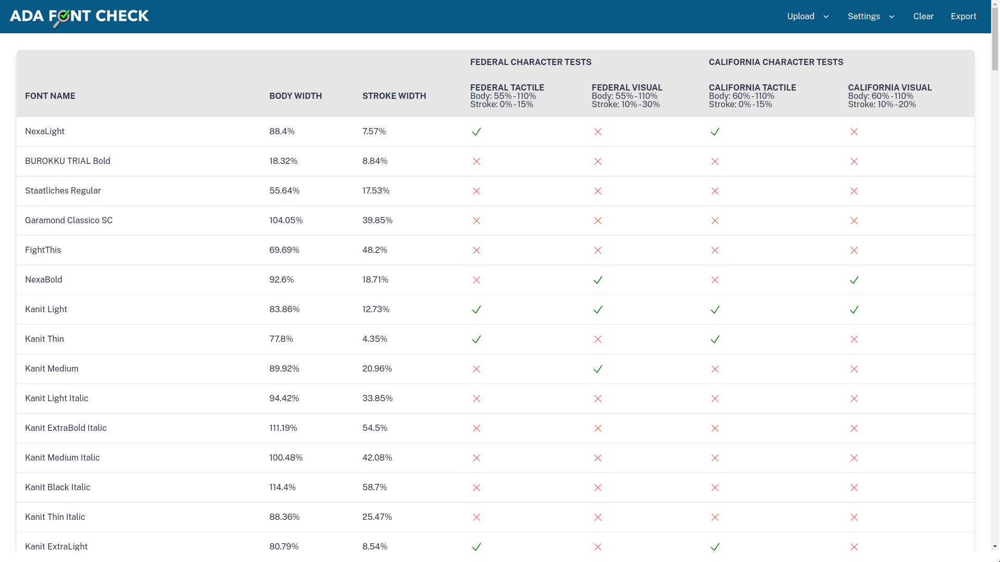
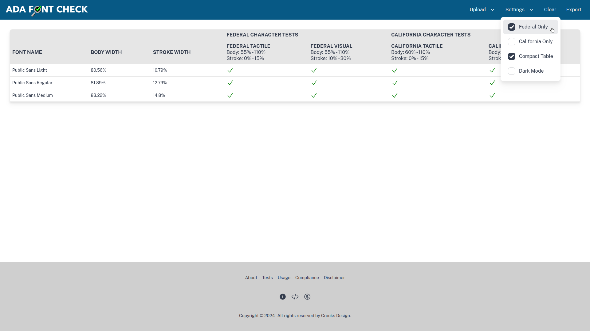

# ADAFontCheck
ADAFontCheck uses [opentype.js](opentype.js.org) to [analyze font glyphs](opentype.js.org/glyph-inspector.html) and determine if the font metrics meet American Disability Association requirements.

## Demo Link -> [adafontcheck.xyz](https://adafontcheck.xyz/)

*View Fonts at a glance*

*Compact view*

## About ADA Font Check
ADAFontCheck determines if a font meets U.S. Federal and California ADA accessibility regulations for tactile and visual signage using opentype.js

## ADA Tests Overview
ADAFontCheck perfoms the following tests:
* Character Stroke Width ratio using the uppercase letter 'I'.
* Character Body Width ratio using the uppercase letters 'I,' 'H,' and 'O'.
* Italic Font detection.
* Serif Font detection.
* Sans Serif Font determination.
* Fonts must meet the ratio requirements of both Tests 1 and 2 for ADA compliance.
* Numerals are not tested for compliance but are considered compatible when used with letters of the same font set and size.

## How to use ADAFontCheck
1. Select “All Fonts” to display both Pass and Fail fonts. Select “ADA Fonts Only” to display just Pass fonts.
2. Select “Folder Upload” for multiple fonts or “File Upload” for a single font.
3. Navigate to your fonts source files.
4. Select the fonts and upload.
5. Review the test results. _Note that results appear for Sans Serif fonts only. Fonts that are not Sans Serif do not comply with ADA requirements._
6. Export the tests results.

## ADAFontCheck Compliance Information
This service is based on 2010 Americans with Disabilities Act Accessibility Guidelines (703.2.4, 703.2.6, 703.5.4, 703.5.7) and 2019 California Building Standards Code (11B-703.2.4 / 1143A.6.4, 11B-703.2.6 / 1143.A.6.5, 11B-703.5.4 / 1143.A.5.3, 11B-703.5.7 / 1143A.5.6).

## Disclaimer
ADAFontCheck is not endorsed by the United States Access Board or anyone else.
The creators of ADAFontCheck assume no liability or responsibility whatsoever for any direct, indirect, special, or other consequential damages relating to any use of this online service or the contents of this website.
Use at your own discretion with confidence.
