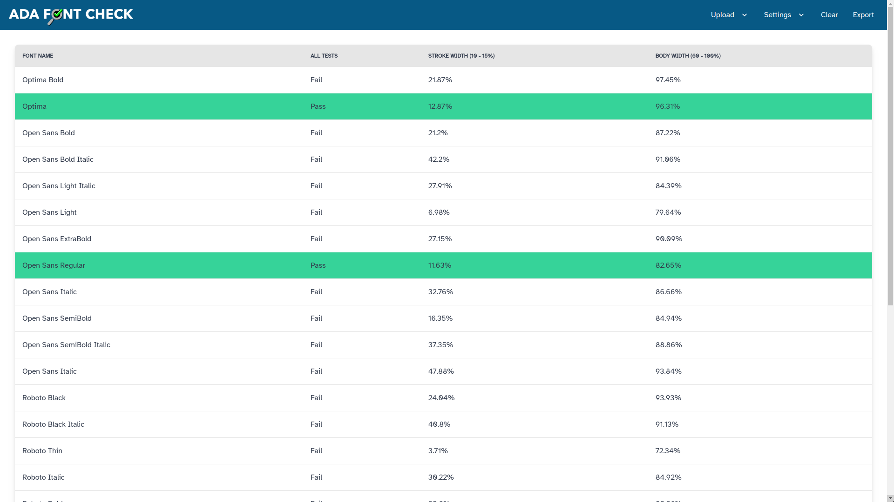
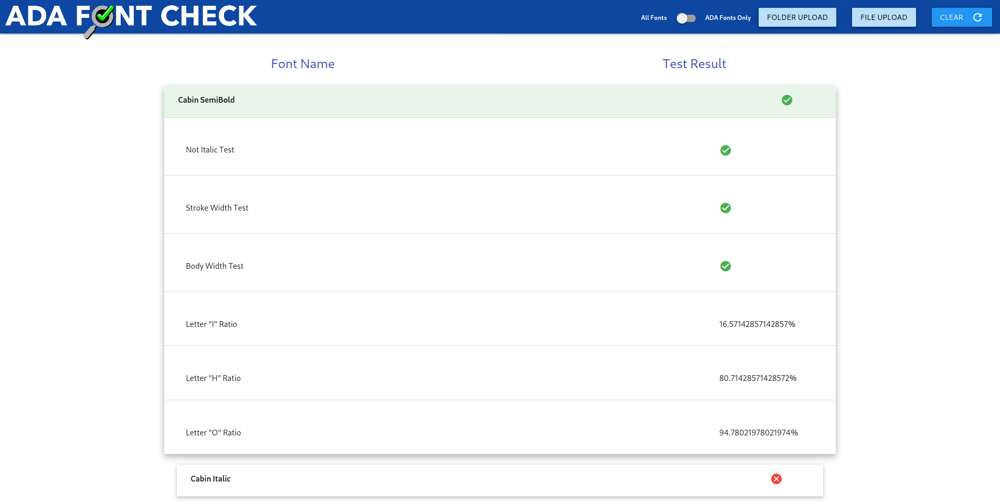

# ADAFontCheck
ADAFontCheck uses [opentype.js](opentype.js.org) to [analyze font glyphs](opentype.js.org/glyph-inspector.html) and determine if the font metrics meet American Disability Association requirements.

## Demo Link -> [adafontcheck.xyz](https://adafontcheck.xyz/)

*View Fonts at a glance*

*Verbose view*

### ADA Requirements
1. Stroke Width Ratio: **0% - 15%** _(Updated to comply with stricter California Guidelines)_
2. Body Width Ratio: **60% - 100%**
3. No Italic Fonts
4. No San Serif

## How it Works
ADAFontCheck uses the letters "I", "H", and "O" to determine the Stroke Width Ratio and Body Width Ratio.
